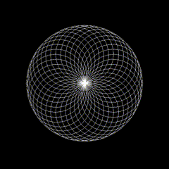

<p align="center">
  
</p>
<h1 align="center">Python Art</h1>

This repository is a collection of fun and mesmerizing geometric patterns and designs created using Python's `turtle` graphics library. This is just for fun, and I'll be adding new creations as I experiment with different ideas and techniques.

## ✨ About

The primary purpose of this repository is to explore creativity with code, and generate beautiful art using Python and the turtle module. Each piece of art in this collection is uniquely designed to create visually pleasing patterns. Whether it's kaleidoscopic designs, mandalas, or other geometric creations, this is all about having fun with code!

## 📂 Folder Structure

- **arts/**: This folder contains all the artwork generated using the turtle module. You can find GIFs, images, and scripts that correspond to each piece of art.
- **scripts/**: The code to generate the turtle art.

## 🚀 Getting Started

To create your own turtle art or run the existing scripts, you'll need Python installed on your machine. Follow these steps:

1. **Clone the repository**:

   ```bash
   git clone https://github.com/JohnSesana/python-art.git
   cd python-art
   ```

2. **Install Python**: Make sure you have Python 3 installed. You can download it from python.org.

3. **Run the scripts**: Each Python script can be executed individually to generate a different piece of art. For example:

```bash
cd scripts
python kaleidoscope_circles.py
```

4. **Explore and create**: Modify the code to experiment with new shapes, colors, and designs!

## License

This project is open-source and available under the MIT License. Feel free to use, modify, and share it as you like.
